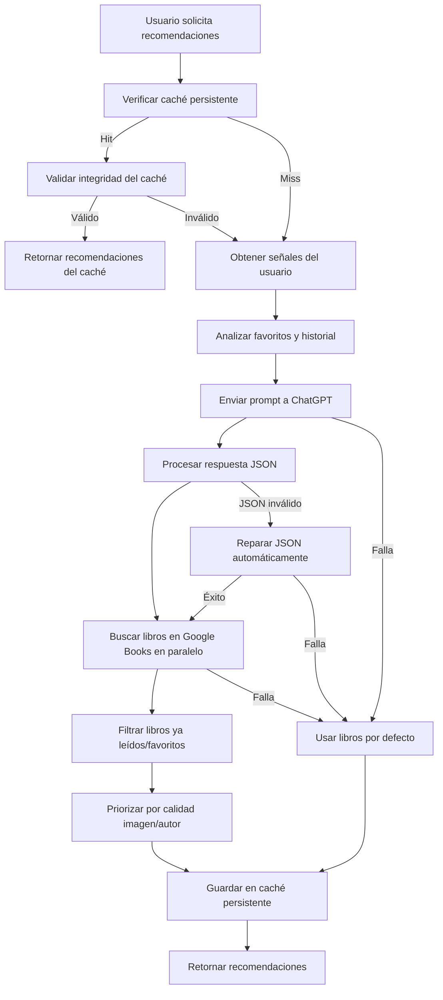

# Sistema de Recomendaciones - Home

## 📚 Descripción

Sistema inteligente de recomendaciones de libros para la pantalla de inicio que combina señales del usuario con IA (ChatGPT), caché inteligente y fallbacks locales. El sistema está optimizado para proporcionar recomendaciones consistentes y de alta calidad, con un enfoque en la personalización basada en el historial de lectura del usuario.

## 🏗️ Arquitectura del Sistema

### **Archivos Principales:**

- `homeRecs.js` - Lógica principal de recomendaciones, integración con ChatGPT y Google Books API
- `homeDefaults.js` - Libros por defecto con portadas reales de Google Books (fallback cuando no hay datos del usuario)
- `recommendationCache.js` - Caché de versiones recomendadas para mantener consistencia entre recomendaciones y búsquedas
- `preferredBooks.js` - Sistema de priorización por calidad en búsquedas (imagen, autor, descripción)

### **Base de Datos:**

- **Tabla `Lectura`** - Historial de lecturas del usuario con campo `titulo` para análisis de gustos
- **Tabla `User`** - Información del usuario incluyendo `librosFavoritos` (JSON array)
- **Relaciones** - Lecturas vinculadas a usuarios para análisis de patrones de lectura

## 🔄 Flujo de Recomendaciones

### **1. Obtención de Señales del Usuario**

```javascript
// getUserSignals() - homeRecs.js
const signals = {
  favoritos: [], // Top 3 favoritos del usuario (objetos completos con title/authors)
  historialLikes: [], // Títulos de libros con rating >= 3 (array de strings)
  historialDislikes: [], // Títulos de libros con rating <= 2 (array de strings)
  historialCompleto: [], // Array de libroIds de todas las lecturas
};
```

### **2. Estrategias de Recomendación**

#### **Estrategia Principal: ChatGPT + Google Books**

1. **Análisis de señales** - Procesa favoritos, likes y dislikes del usuario
2. **Prompt a ChatGPT** - Envía títulos de libros que le gustaron y no le gustaron
3. **Respuesta estructurada** - ChatGPT devuelve 20+20 recomendaciones en formato JSON
4. **Búsqueda en Google Books** - Para cada recomendación de ChatGPT
5. **Validación y filtrado** - Excluye libros ya leídos o en favoritos
6. **Caché de versiones** - Guarda la versión exacta recomendada para consistencia

#### **Estrategia Fallback: Libros por Defecto**

- Se activa cuando ChatGPT falla o no hay datos del usuario
- Usa libros predefinidos con portadas reales de Google Books
- No requiere consultas a APIs externas
- Garantiza que siempre haya recomendaciones disponibles

### **3. Sistema de Caché Inteligente**

#### **Caché de Recomendaciones (homeRecs.js)**

- **Duración**: `Infinity` - Persistente hasta invalidación explícita
- **Persistencia**: Mientras el usuario esté logueado en la sesión
- **Invalidación**: Solo al desloguearse o reiniciar servidor
- **Estructura**: `Map<userId, {data, timestamp}>`
- **Validación**: Verifica integridad del caché antes de usar

#### **Caché de Versiones (recommendationCache.js)**

- **Propósito**: Mantener consistencia entre recomendaciones y búsquedas manuales
- **Duración**: 24 horas por entrada
- **Clave**: `"${titulo}_${autor}"` (normalizada)
- **Funciones**:
  - `saveRecommendedVersion()` - Guardar versión exacta recomendada
  - `getRecommendedVersion()` - Obtener versión del caché
  - `findSimilarCachedVersion()` - Buscar versión similar por título
  - `cleanExpiredCache()` - Limpiar entradas expiradas

## 🔍 Sistema de Búsqueda y Procesamiento

### **Búsqueda en Google Books API**

```javascript
// homeRecs.js - searchGoogleBooks()
const searchParams = {
  q: `intitle:"${searchQuery}"`, // Búsqueda por título exacto
  maxResults: 20,
  printType: "books",
  orderBy: "relevance",
  key: GOOGLE_BOOKS_API_KEY,
};
```

### **Procesamiento Paralelo de Recomendaciones**

```javascript
// homeRecs.js - processLLMRecommendations()
const BATCH_SIZE = 10; // Procesar de a 10 libros por vez
const DELAY_BETWEEN_BOOKS = 50; // 50ms entre libros
const DELAY_BETWEEN_BATCHES = 200; // 200ms entre batches
```

### **Priorización de Resultados**

1. **Versión del caché** - Si existe, se muestra primero
2. **Libros con imagen** - Se priorizan sobre los sin imagen
3. **Libros con autor** - Se priorizan sobre los sin autor
4. **Sistema de calidad** - Ordenamiento por criterios de calidad

### **Filtrado Inteligente**

- **Exclusión de historial** - No recomienda libros ya leídos
- **Exclusión de favoritos** - No recomienda libros en favoritos
- **Deduplicación** - Evita duplicados entre listas
- **Validación de integridad** - Verifica que los libros sean válidos

## 🎯 Sistema de Priorización por Calidad

### **Criterios de Evaluación Simplificados (preferredBooks.js)**

```javascript
const prioritizeBooksByQuality = (books, searchQuery = null) => {
  // Ordenamiento simple y rápido por criterios básicos
  return books
    .filter((book) => book.title) // Solo libros con título
    .sort((a, b) => {
      // 1. Priorizar libros con imagen
      const aHasImage = a.image && !a.image.includes("placehold.co");
      const bHasImage = b.image && !b.image.includes("placehold.co");

      if (aHasImage && !bHasImage) return -1;
      if (!aHasImage && bHasImage) return 1;

      // 2. Priorizar libros con autor
      const aHasAuthor = a.authors && a.authors.length > 0;
      const bHasAuthor = b.authors && b.authors.length > 0;

      if (aHasAuthor && !bHasAuthor) return -1;
      if (!aHasAuthor && bHasAuthor) return 1;

      return 0;
    });
};
```

### **Selección de Mejores Libros**

- **Prioridad por imagen** - Libros con portada real primero
- **Prioridad por autor** - Libros con información de autor
- **Filtrado por calidad** - Solo libros con datos completos
- **Deduplicación** - Evita libros repetidos en resultados

## 🚀 APIs y Endpoints

### **Recomendaciones del Home**

#### `GET /api/recommendations/home?userId={userId}`

Obtiene recomendaciones personalizadas para el usuario:

```json
{
  "tePodrianGustar": [
    {
      "volumeId": "DqIPAAAACAAJ",
      "title": "El Señor de los Anillos",
      "authors": ["J.R.R. Tolkien"],
      "categories": ["Fiction", "Fantasy"],
      "description": "Una épica aventura de fantasía...",
      "image": "https://books.google.com/books/publisher/content/images/frontcover/DqIPAAAACAAJ?fife=w400-h600&source=gbs_api",
      "reason": "Recomendado por IA"
    }
  ],
  "descubriNuevasLecturas": [
    {
      "volumeId": "5PQEAAAAMAAJ",
      "title": "1984",
      "authors": ["George Orwell"],
      "categories": ["Fiction", "Dystopian"],
      "description": "Una distopía clásica...",
      "image": "https://books.google.com/books/publisher/content/images/frontcover/5PQEAAAAMAAJ?fife=w400-h600&source=gbs_api",
      "reason": "Recomendado por IA"
    }
  ],
  "metadata": {
    "strategy": "llm+googlebooks",
    "generatedAt": "2024-01-15T10:30:00.000Z",
    "userId": 123
  }
}
```

### **Estrategias de Recomendación**

- **`llm+googlebooks`** - ChatGPT + Google Books (estrategia principal)
- **`fallback-defaults`** - Libros por defecto (cuando ChatGPT falla)
- **`llm-progressive`** - Carga progresiva de recomendaciones
- **`llm-two-phase`** - Carga en dos fases (5+5 inicial, luego completo)

### **Búsqueda de Libros**

#### `GET /api/books/search?q={query}&generateDescriptions={true/false}`

Busca libros en Google Books con optimizaciones:

```json
{
  "books": [
    {
      "id": "DqIPAAAACAAJ",
      "title": "El Señor de los Anillos",
      "authors": ["J.R.R. Tolkien"],
      "categories": ["Fiction", "Fantasy"],
      "description": "Una épica aventura de fantasía...",
      "image": "https://books.google.com/books/publisher/content/images/frontcover/DqIPAAAACAAJ?fife=w400-h600&source=gbs_api",
      "averageRating": 4.5,
      "pageCount": 1216,
      "language": "es"
    }
  ],
  "totalResults": 1
}
```

### **Funciones de Utilidad**

- **`getUserSignals(userId)`** - Obtiene señales del usuario
- **`searchSpecificBook(title, author)`** - Busca un libro específico
- **`clearUserCache(userId)`** - Limpia caché del usuario
- **`clearAllCache()`** - Limpia todo el caché

## 🛡️ Manejo de Errores y Fallbacks

### **Rate Limiting de Google Books API**

- **Límite**: 100 consultas/minuto
- **Manejo**: Delays escalonados entre consultas (50ms entre libros, 200ms entre batches)
- **Retry automático**: Reintenta después de 8 segundos si se alcanza el límite
- **Fallback**: Libros por defecto si se excede el límite persistentemente

### **Sistema de Fallbacks en Cascada**

1. **ChatGPT falla** → Usar libros por defecto
2. **Google Books falla** → Usar libros por defecto
3. **Libro no encontrado** → Buscar libro de reemplazo
4. **Caché corrupto** → Regenerar automáticamente
5. **Sin datos del usuario** → Usar libros por defecto directamente

### **Validaciones y Correcciones**

- **Integridad del caché**: Verifica que tenga libros válidos
- **Respuesta de ChatGPT**: Repara JSON malformado automáticamente
- **Datos de Google Books**: Valida estructura y campos requeridos
- **Filtrado de duplicados**: Elimina libros repetidos entre listas
- **Exclusión de historial**: No recomienda libros ya leídos o en favoritos

### **Sistema de Recuperación**

- **Reemplazo de libros inválidos**: Busca alternativas automáticamente
- **Completado de listas parciales**: Usa libros de la otra lista si es necesario
- **Validación continua**: Verifica integridad en cada paso del proceso

## 📊 Logs del Sistema

### **Recomendaciones**

```
[Recommendations] Generando recomendaciones para usuario 123
[Recommendations] Estrategia: llm+googlebooks
[Signals] Obteniendo señales para usuario 123
[Signals] Favoritos procesados: 3 libros
[Signals] Historial LIKES (rating >= 3): 5 libros
[Signals] Historial DISLIKES (rating <= 2): 2 libros
[LLM] Enviando consulta a ChatGPT...
[Process] Procesando recomendaciones del LLM con paralelización controlada...
[Process] Resultado final: tePodrianGustar=10, descubriNuevasLecturas=10
[Cache] Guardando en caché para usuario 123
```

### **Caché**

```
[Cache] Verificando caché para usuario 123
[Cache] ✅ HIT para usuario 123, usando cache existente
[Cache] Cache generado: 12/21/2024, 3:45:30 PM
[Cache] Estrategia usada: llm+googlebooks
[Cache] Caché válido: 10 + 10 libros
```

### **Búsqueda y Procesamiento**

```
[GoogleBooks] Búsqueda: "El Alquimista"
[GoogleBooks] Resultados encontrados: 15 libros
[Quality] Priorizando 15 libros (modo rápido)
[Quality] Priorizados 15 libros (modo rápido)
[Process] ✅ Agregado a te_podrian_gustar: El Alquimista
[Cache] Guardando versión recomendada: "El Alquimista" (ID: 5PQEAAAAMAAJ)
```

### **Manejo de Errores**

```
[LLM] ❌ ERROR PARSING JSON: Unexpected token
[LLM] 🔧 INTENTANDO REPARAR JSON...
[LLM] ✅ JSON REPARADO exitosamente
[GoogleBooks] Rate limit alcanzado, esperando 8 segundos...
[Process] ⚠️ Timeout o error para "Libro X": Timeout
[Backup] Activando sistema de respaldo mejorado...
```

## 🔧 Configuración

### **Variables de Entorno**

```env
GOOGLE_BOOKS_API_KEY=tu_api_key_aqui
OPENAI_API_KEY=tu_openai_key_aqui
```

### **Configuración de Procesamiento**

```javascript
// homeRecs.js - Procesamiento paralelo
const BATCH_SIZE = 10; // Libros por batch
const DELAY_BETWEEN_BOOKS = 50; // ms entre libros
const DELAY_BETWEEN_BATCHES = 200; // ms entre batches
const TIMEOUT_PER_BOOK = 5000; // ms timeout por libro
```

### **Configuración de Caché**

```javascript
// recommendationCache.js
const CACHE_DURATION = 24 * 60 * 60 * 1000; // 24 horas
const MAX_CACHE_SIZE = 1000; // Máximo 1000 entradas

// homeRecs.js
const CACHE_DURATION = Infinity; // Caché persistente por sesión
```

## 🚀 Beneficios del Sistema

✅ **Personalización**: Recomendaciones basadas en historial real del usuario  
✅ **Consistencia**: Mismas recomendaciones durante toda la sesión  
✅ **Performance**: Caché inteligente y procesamiento paralelo  
✅ **Calidad**: Sistema de priorización por imagen y autor  
✅ **Confiabilidad**: Múltiples fallbacks en cascada  
✅ **Escalabilidad**: Procesamiento paralelo controlado  
✅ **UX**: Experiencia fluida y predecible  
✅ **Debugging**: Logs detallados para monitoreo  
✅ **Recuperación**: Sistema automático de corrección de errores

## 🔄 Flujo de Datos Completo



## 📝 Notas de Desarrollo

- **ChatGPT**: Recibe títulos de libros que le gustaron/no le gustaron al usuario
- **Google Books**: Rate limit de 100 consultas/minuto con retry automático
- **Caché**: Persistente por sesión, se invalida solo al desloguearse
- **Procesamiento**: Paralelo en batches de 10 libros con delays controlados
- **Búsqueda**: Prioriza versión del caché si existe para consistencia
- **Imágenes**: Placeholders automáticos para libros sin portada
- **Calidad**: Priorización simple por imagen y autor para velocidad
- **Recuperación**: Sistema automático de reemplazo de libros inválidos
