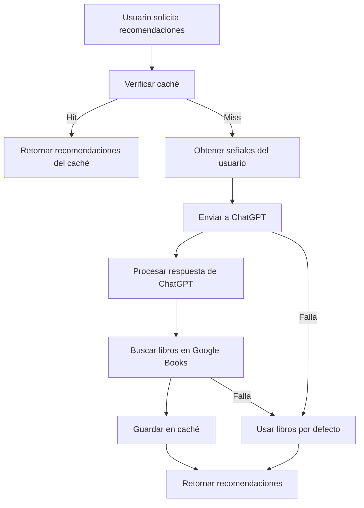

# Sistema de Recomendaciones - Home

## 📚 Descripción

Sistema inteligente de recomendaciones de libros para la pantalla de inicio que combina señales del usuario con IA (ChatGPT), caché inteligente y fallbacks locales. El sistema está optimizado para proporcionar recomendaciones consistentes y de alta calidad.

## 🏗️ Arquitectura del Sistema

### **Archivos Principales:**

- `homeRecs.js` - Lógica principal de recomendaciones y ChatGPT
- `homeDefaults.js` - Libros por defecto con portadas reales de Google Books
- `recommendationCache.js` - Caché de versiones recomendadas para consistencia
- `preferredBooks.js` - Sistema de priorización por calidad en búsquedas

### **Base de Datos:**

- **Tabla `Lectura`** - Incluye campo `titulo` para simplificar recomendaciones
- **Tabla `Favorito`** - Libros marcados como favoritos por el usuario
- **Tabla `User`** - Información del usuario

## 🔄 Flujo de Recomendaciones

### **1. Obtención de Señales del Usuario**

```javascript
// getUserSignals() - homeRecs.js
const signals = {
  favoritos: [], // Objetos completos con title/authors
  historialLikes: [], // Array de strings (títulos)
  historialDislikes: [], // Array de strings (títulos)
  historialCompleto: [], // Array de libroIds
};
```

### **2. Generación de Recomendaciones**

#### **Estrategia Principal: ChatGPT + Google Books**

1. **Envío a ChatGPT** - Solo títulos en `historialLikes` y `historialDislikes`
2. **Procesamiento de respuesta** - 24 recomendaciones (12 + 12)
3. **Búsqueda en Google Books** - Para cada recomendación
4. **Caché de versiones** - Guardar versión exacta recomendada

#### **Estrategia Fallback: Libros por Defecto**

- Se activa cuando ChatGPT falla
- Usa libros predefinidos con portadas reales
- No requiere consultas a APIs externas

### **3. Sistema de Caché**

#### **Caché de Recomendaciones (homeRecs.js)**

- **Duración**: `Infinity` - Hasta que se invalide explícitamente
- **Persistencia**: Mientras el usuario esté logueado
- **Invalidación**: Solo al desloguearse

#### **Caché de Versiones (recommendationCache.js)**

- **Propósito**: Mantener consistencia entre recomendaciones y búsquedas
- **Duración**: 24 horas
- **Funciones**:
  - `saveRecommendedVersion()` - Guardar versión recomendada
  - `getRecommendedVersion()` - Obtener versión del caché
  - `findSimilarCachedVersion()` - Buscar versión similar

## 🔍 Sistema de Búsqueda

### **Búsqueda Flexible y Ordenada**

```javascript
// bookController.js - searchGoogleBooks()
const searchParams = {
  q: `intitle:"${searchQuery}"`, // Búsqueda por título
  maxResults: 20,
  printType: "books",
  orderBy: "relevance",
};
```

### **Priorización de Resultados**

1. **Versión del caché** - Si existe, se muestra primero
2. **Libros con imagen** - Se muestran al inicio
3. **Libros sin imagen** - Se muestran al final
4. **Sistema de calidad** - Solo si no hay versión en caché

### **Matching de Títulos**

```javascript
const titleMatchesSearch = (title, searchQuery) => {
  // Búsqueda flexible que permite variaciones
  // - Normaliza caracteres especiales
  // - Busca palabras importantes (>2 caracteres)
  // - Permite coincidencias parciales
};
```

## 🎯 Sistema de Priorización por Calidad

### **Criterios de Evaluación (preferredBooks.js)**

```javascript
const calculateBookQualityScore = (book, searchQuery) => {
  let score = 0;

  // Título exacto: +50 puntos
  if (book.title.toLowerCase() === searchQuery.toLowerCase()) score += 50;

  // Coincidencia de palabras: +30 puntos
  if (titleMatchesSearch(book.title, searchQuery)) score += 30;

  // Tiene imagen: +20 puntos
  if (book.image && !book.image.includes("placehold.co")) score += 20;

  // Tiene descripción: +10 puntos
  if (book.description && book.description.length > 50) score += 10;

  // Tiene rating: +5 puntos
  if (book.averageRating && book.averageRating > 0) score += 5;

  return score;
};
```

### **Agrupación por Título**

- Agrupa libros con títulos similares
- Selecciona la mejor versión de cada grupo
- Evita duplicados en resultados

## 🚀 APIs y Endpoints

### **Recomendaciones**

#### `GET /api/recommendations/home?userId={userId}`

Obtiene recomendaciones para el usuario:

```json
{
  "tePodrianGustar": [
    {
      "volumeId": "DqIPAAAACAAJ",
      "title": "El Señor de los Anillos",
      "authors": ["J.R.R. Tolkien"],
      "image": "https://books.google.com/books/publisher/content/images/frontcover/DqIPAAAACAAJ?fife=w400-h600&source=gbs_api",
      "reason": "Clásico de fantasía épica"
    }
  ],
  "descubriNuevasLecturas": [...],
  "metadata": {
    "strategy": "llm+shortlist",
    "generatedAt": "2024-01-15T10:30:00.000Z",
    "userId": 123
  }
}
```

#### `GET /api/recommendations/cache-status?userId={userId}`

Verifica estado del caché:

```json
{
  "userId": "123",
  "hasCache": true,
  "timestamp": 1703123456789,
  "age": "2h 15m",
  "strategy": "llm+shortlist",
  "tePodrianGustar": 12,
  "descubriNuevasLecturas": 12
}
```

#### `POST /api/recommendations/invalidate`

Invalida el caché:

```json
{
  "userId": "123"
}
```

### **Búsqueda**

#### `GET /api/books/search?q={query}&filter={filter}`

Busca libros en Google Books:

```json
{
  "books": [
    {
      "id": "DqIPAAAACAAJ",
      "title": "El Señor de los Anillos",
      "authors": ["J.R.R. Tolkien"],
      "image": "https://books.google.com/books/publisher/content/images/frontcover/DqIPAAAACAAJ?fife=w400-h600&source=gbs_api",
      "description": "Una épica aventura de fantasía...",
      "averageRating": 4.5
    }
  ],
  "totalResults": 1
}
```

## 🛡️ Manejo de Errores y Fallbacks

### **Rate Limiting de Google Books API**

- **Límite**: 100 consultas/minuto
- **Manejo**: Delays de 1 segundo entre consultas
- **Fallback**: Libros por defecto si se excede el límite

### **Fallbacks del Sistema**

1. **ChatGPT falla** → Libros por defecto
2. **Google Books falla** → Libros por defecto
3. **Libro no encontrado** → Se reemplaza con libro por defecto
4. **Caché corrupto** → Se regenera automáticamente

### **Validaciones**

- **Integridad del caché**: Exactamente 12+12 libros
- **Respuesta de ChatGPT**: Formato JSON válido
- **Datos de Google Books**: Estructura correcta

## 📊 Logs del Sistema

### **Recomendaciones**

```
[Recommendations] Generando recomendaciones para usuario 123
[Recommendations] Estrategia: llm+shortlist
[Recommendations] Señales obtenidas: 3 favoritos, 5 likes, 2 dislikes
[Recommendations] Enviando a ChatGPT: 24 recomendaciones
[Recommendations] Procesando respuesta de ChatGPT...
[Recommendations] Buscando libros en Google Books...
[Recommendations] ✅ Recomendaciones generadas: 12 + 12 libros
```

### **Caché**

```
[Cache] Hit para usuario 123, usando cache existente
[Cache] Cache generado: 12/21/2024, 3:45:30 PM
[Cache] Estrategia usada: llm+shortlist
[Cache] Caché válido: 12 + 12 libros
```

### **Búsqueda**

```
[GoogleBooks] Búsqueda: "El Alquimista"
[GoogleBooks] Resultados encontrados: 15 libros
[GoogleBooks] Priorizando versión del cache: El Alquimista (ID: 5PQEAAAAMAAJ)
[GoogleBooks] Ordenando por calidad: 8 libros con imagen, 7 sin imagen
```

## 🔧 Configuración

### **Variables de Entorno**

```env
GOOGLE_BOOKS_API_KEY=tu_api_key_aqui
OPENAI_API_KEY=tu_openai_key_aqui
```

### **Configuración de Caché**

```javascript
// recommendationCache.js
const CACHE_DURATION = 24 * 60 * 60 * 1000; // 24 horas
const MAX_CACHE_SIZE = 1000; // Máximo 1000 entradas
```

## 🚀 Beneficios del Sistema

✅ **Consistencia**: Mismas recomendaciones durante toda la sesión  
✅ **Performance**: Caché inteligente reduce consultas a APIs  
✅ **Calidad**: Sistema de priorización por calidad  
✅ **Flexibilidad**: Búsqueda flexible y ordenada  
✅ **Confiabilidad**: Múltiples fallbacks para garantizar funcionamiento  
✅ **UX**: Experiencia predecible y fluida para el usuario  
✅ **Debugging**: Logs detallados para monitoreo y troubleshooting

## 🔄 Flujo de Datos Completo



## 📝 Notas de Desarrollo

- **ChatGPT**: Solo recibe títulos, no objetos completos
- **Google Books**: Rate limit de 100 consultas/minuto
- **Caché**: Se invalida solo al desloguearse
- **Búsqueda**: Prioriza versión del caché si existe
- **Imágenes**: Placeholders para libros sin portada
- **Calidad**: Sistema de puntuación para ordenar resultados
